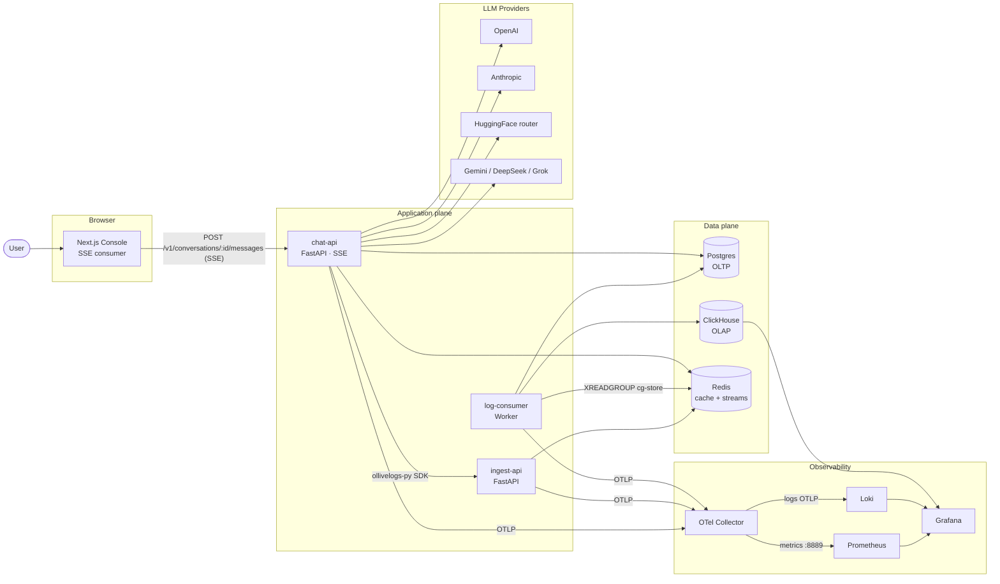
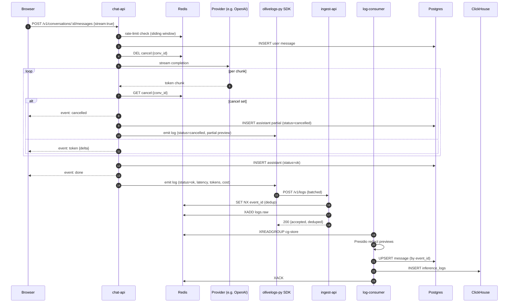
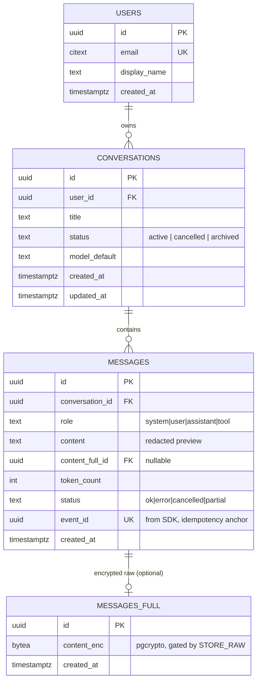
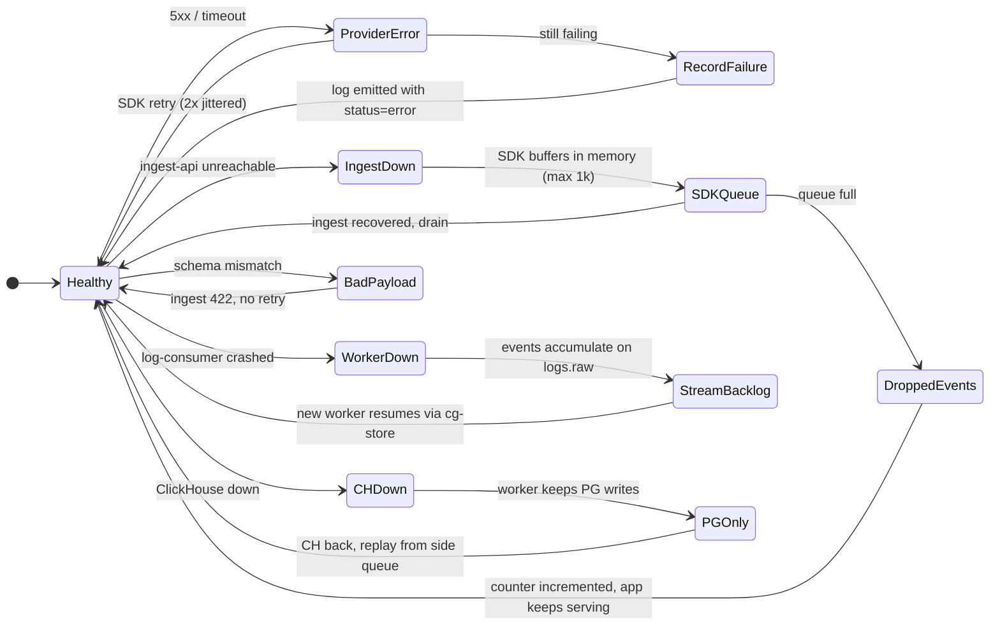
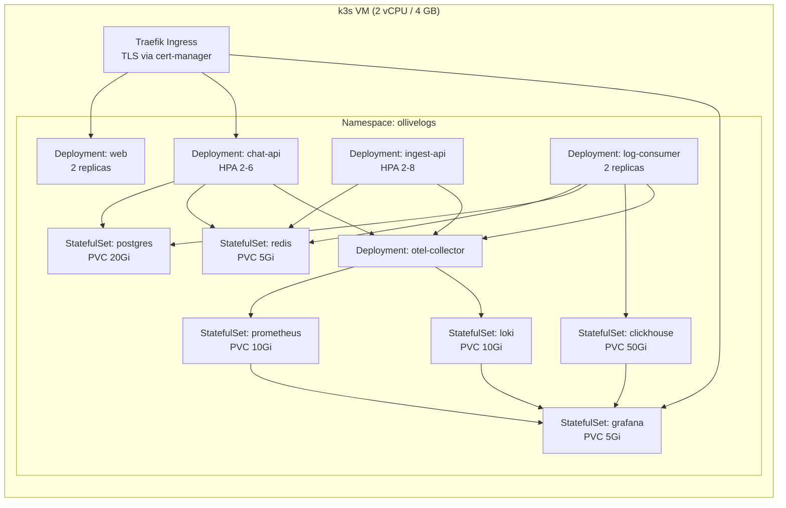
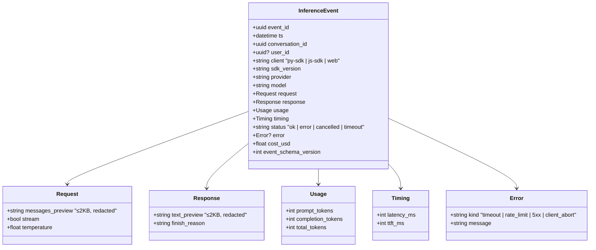
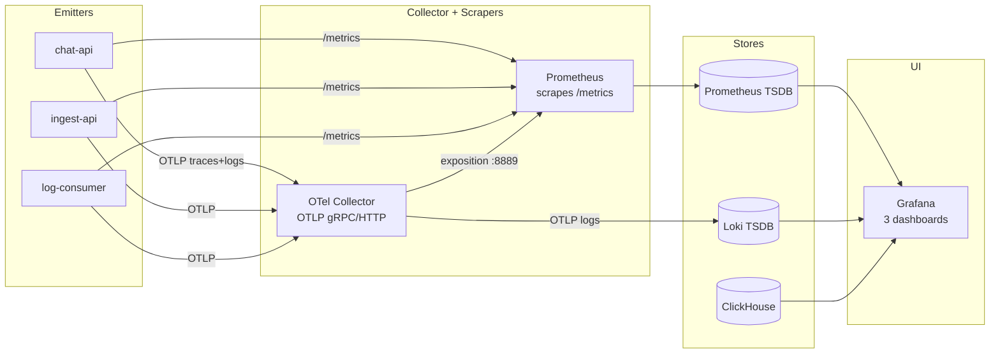

# Architecture · OlliveLogs

Visual companion to [DESIGN.md](../DESIGN.md). Mermaid diagrams render natively on GitHub.

---

## 1. System context

---

## 2. Send-a-message sequence (streaming + cancel)

The cancel flag is **idempotent and TTL-bounded** so a forgotten flag from a previous attempt can't kill a fresh request.

---

## 3. Data model

**ClickHouse `inference_logs`** is a separate, flat append-only table — no foreign keys, no joins. Joined logically by `event_id` for forensic queries.

---

## 4. Failure modes

---

## 5. Deployment topology — k3s (single VM)

HPA targets:

- **chat-api**: CPU 70% or 50 RPS/pod
- **ingest-api**: CPU 60% or 300 RPS/pod
- **log-consumer**: not autoscaled (stream backpressure is the regulator)

PVCs are sized for a 30-day demo run. ClickHouse partitions are dropped at `TTL ts + INTERVAL 90 DAY`.

---

## 6. Event schema (SDK → ingest)

Validation lives in [apps/ingest-api/ingest_app/schemas.py](../apps/ingest-api/ingest_app/schemas.py). Schema is versioned via `event_schema_version`.

---

## 7. Observability pipeline

Dashboards (committed JSON under [infra/grafana/dashboards/](../infra/grafana/dashboards/)):

1. **Inference Health** — RPS, p50/95/99 latency, TTFT, error rate, slowest 25 calls
2. **Cost & Tokens** — $/min by provider, top conversations by spend, tokens in vs out
3. **Ingestion Pipeline** — events/sec by status, dedup rate, ingest p99, worker lag, DLQ count
